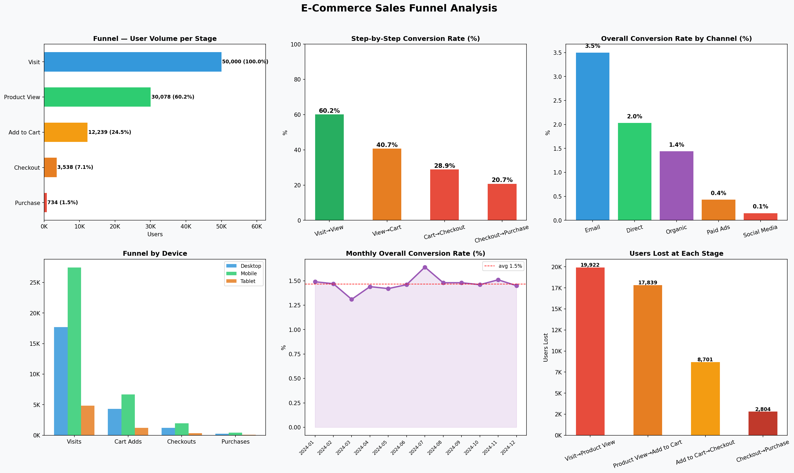

# 🛒 E-Commerce Sales Funnel Drop-off Analysis

Analyzes where and why users drop out of the purchase funnel across 50,000 sessions. Breaks down conversion by channel, device, and month — and flags the biggest revenue leakage points.

---

## What It Does

Models the full e-commerce funnel:

```
Visit → Product View → Add to Cart → Checkout → Purchase
```

At each stage, calculates:
- How many users dropped off
- Step-by-step conversion rate
- Which channel and device converts best
- Where the business is losing the most potential revenue

---

## How to Run

```bash
cd major-projects/sales-funnel-analysis
pip install pandas numpy matplotlib
python src/funnel_analysis.py
```

---

## Output

### Dashboard



---

### Funnel Summary

| Stage | Users | % of Visits | Step Conversion |
|---|---|---|---|
| Visit | 50,000 | 100.0% | — |
| Product View | 30,078 | 60.2% | 60.2% |
| Add to Cart | 12,239 | 24.5% | 40.7% |
| Checkout | 3,538 | 7.1% | 28.9% |
| Purchase | 734 | 1.5% | 20.7% |

**Overall conversion rate: 1.47%**
**Biggest drop-off: Visit → Product View (19,922 users lost)**

---

### Conversion by Channel

| Channel | Visits | Purchases | Conv Rate | Cart→Purchase |
|---|---|---|---|---|
| Email | 10,017 | 351 | **3.50%** | 9.67% |
| Direct | 4,977 | 101 | 2.03% | 6.85% |
| Organic | 15,059 | 217 | 1.44% | 5.70% |
| Paid Ads | 12,515 | 54 | 0.43% | 2.35% |
| Social Media | 7,432 | 11 | 0.15% | 1.07% |

**Email converts 23× better than Social Media despite less traffic.**
**Paid Ads drives high volume but lowest ROI — ad spend needs review.**

---

### Conversion by Device

| Device | Visits | Purchases | Conv Rate | Checkout→Purchase |
|---|---|---|---|---|
| Tablet | 4,849 | 76 | **1.57%** | 22.22% |
| Mobile | 27,453 | 416 | 1.52% | 21.25% |
| Desktop | 17,698 | 242 | 1.37% | 19.55% |

**Mobile drives 55% of traffic but has the lowest checkout-to-purchase rate — UX friction at payment step.**

---

## Key Findings

1. **60% of visitors never view a product** — homepage or landing page is failing to engage
2. **Paid Ads has 0.43% conversion** — spending budget on traffic that doesn't convert
3. **Email is the highest ROI channel** at 3.5% — under-invested relative to paid
4. **Mobile checkout drop-off** is the biggest device-level opportunity
5. **Cart to Checkout is the steepest step drop** — 71.1% of cart adders never reach checkout

## Recommendations

| Finding | Action |
|---|---|
| Homepage bounce (60% don't view product) | A/B test landing page with category-first layout |
| Paid Ads low conv (0.43%) | Audit targeting, pause underperforming ad sets |
| Mobile checkout friction | Simplify payment flow, add UPI/wallet options |
| Email outperforms all channels | Scale email campaigns — highest return per session |
| Cart abandonment (59.3% of cart adds lost) | Trigger cart abandonment email within 2 hours |

---

## Tools

`Python` · `Pandas` · `NumPy` · `Matplotlib`

## Files

```
sales-funnel-analysis/
├── src/funnel_analysis.py       ← main script
├── data/funnel_data.csv         ← generated on run
├── outputs/
│   ├── funnel_dashboard.png     ← 6-panel chart
│   ├── funnel_summary.csv
│   ├── channel_breakdown.csv
│   ├── device_breakdown.csv
│   └── monthly_trend.csv
└── README.md
```

## Interview Talking Points

> "The most important insight here isn't the overall 1.47% conversion — every e-commerce site knows their number. What's interesting is the channel comparison: Paid Ads spends the most money and converts at 0.43%, while Email converts at 3.5% with a fraction of the cost. That's where I'd redirect budget. The second insight is mobile checkout — 55% of traffic comes from mobile but it has the worst checkout-to-purchase rate, which usually means a UX problem at the payment screen, not a demand problem."
